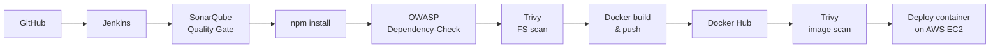
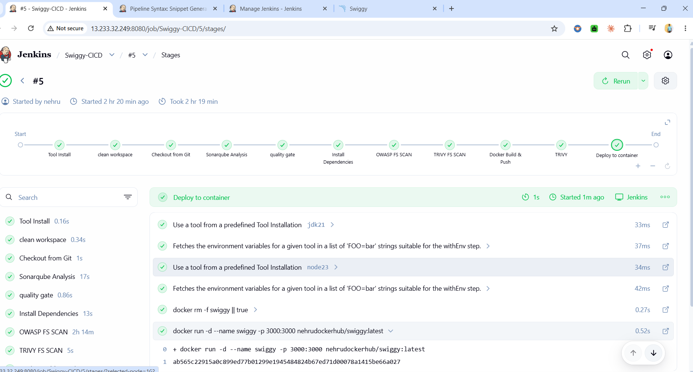
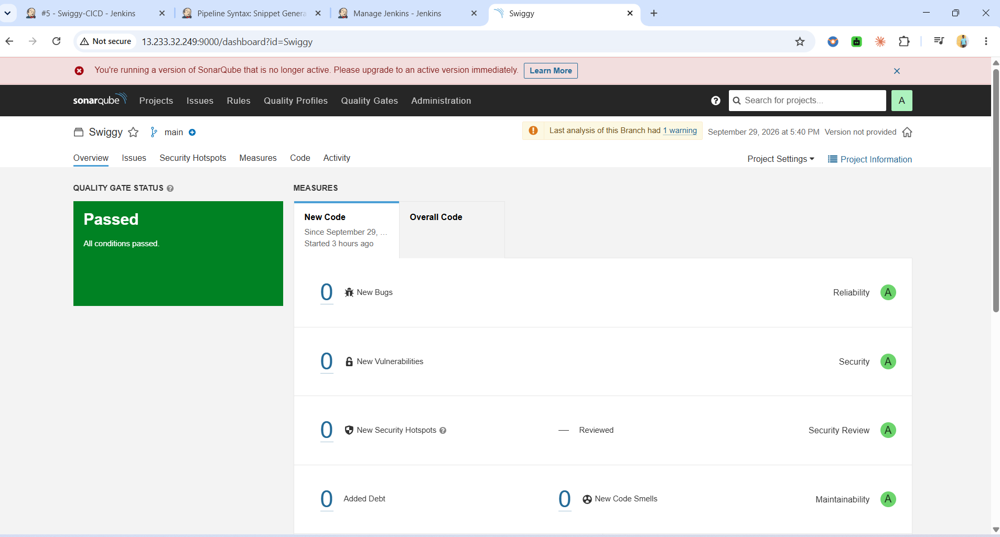
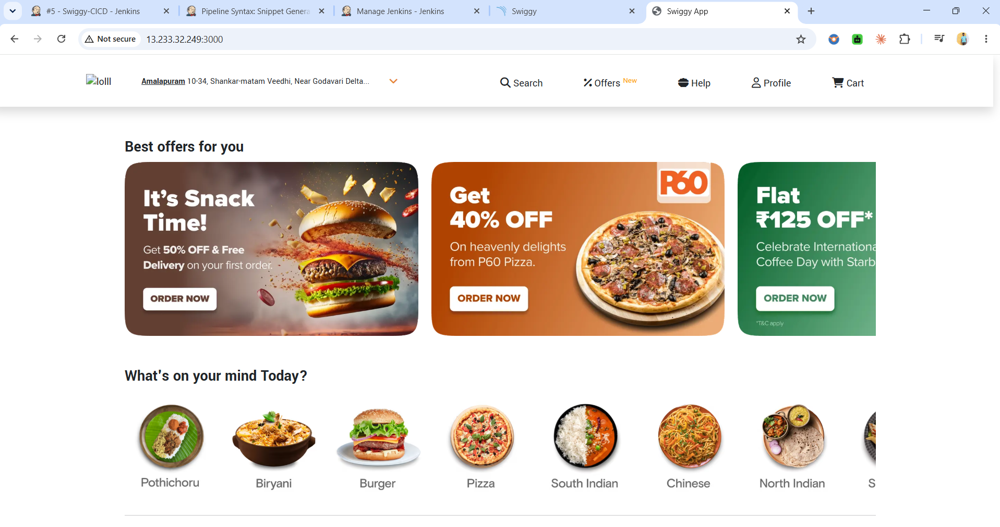
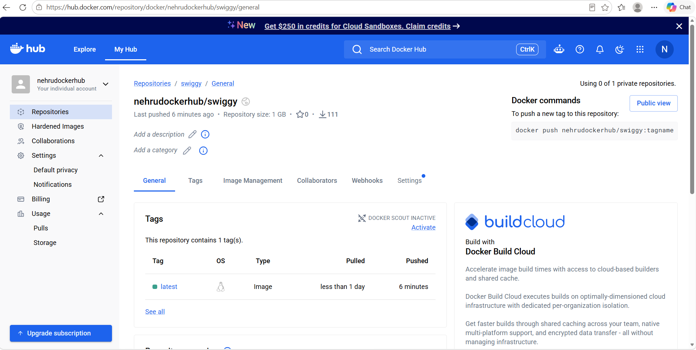

# 🚀 Swiggy Clone: DevSecOps CI/CD Pipeline on AWS

An end-to-end CI/CD pipeline that builds, scans, containerizes, and deploys a Swiggy Clone web app on AWS EC2. Security checks (code quality, dependency vulnerabilities, image vulnerabilities) run automatically on every build, before anything is deployed.

## 📌 What I Built

- Provisioned the AWS infrastructure (EC2, security group) using **Terraform**
- Set up **Jenkins**, **SonarQube**, **Docker**, and **Trivy** on an Ubuntu server with a shell script
- Wrote a declarative **Jenkins pipeline** that runs 10 stages from checkout to deployment
- Added a **SonarQube Quality Gate**, **OWASP Dependency-Check**, and **Trivy** (filesystem and image scans)
- Built the Docker image, pushed it to **Docker Hub**, and deployed it as a container on port 3000
- Debugged real setup issues (see [Challenges & Fixes](#-challenges--fixes))

## 🏗️ Architecture

## 🛠️ Tech Stack

| Area | Tools |
|---|---|
| Cloud | AWS EC2 |
| Infrastructure as Code | Terraform |
| CI/CD | Jenkins (declarative pipeline) |
| Code quality | SonarQube (LTS Community) |
| Dependency scanning | OWASP Dependency-Check 13 |
| Vulnerability scanning | Trivy |
| Containers | Docker, Docker Hub |
| App | React (Swiggy Clone), Node.js 23 |

## 🔄 Pipeline Stages

| # | Stage | What it does |
|---|---|---|
| 1 | Clean workspace | Removes files from the previous build |
| 2 | Checkout from Git | Pulls the source code from GitHub |
| 3 | SonarQube Analysis | Static code analysis with sonar-scanner |
| 4 | Quality Gate | Checks the SonarQube Quality Gate result |
| 5 | Install Dependencies | Runs `npm install` |
| 6 | OWASP FS Scan | Finds known vulnerabilities in dependencies |
| 7 | Trivy FS Scan | Scans the project files for vulnerabilities and secrets |
| 8 | Docker Build & Push | Builds the image and pushes it to Docker Hub |
| 9 | Trivy Image Scan | Scans the built image |
| 10 | Deploy to container | Runs the container on port 3000 |

## ⚙️ Setup Summary

**Server ports (security group):** 22 (SSH), 8080 (Jenkins), 9000 (SonarQube), 3000 (app)

**Recommended instance:** t2.medium or larger (Jenkins and SonarQube together need about 4 GB RAM)

1. Provision the EC2 instance with Terraform
2. Run the install script for Java 21, Jenkins, Docker, SonarQube (container), and Trivy
3. In Jenkins, install the plugins: SonarQube Scanner, OWASP Dependency-Check, Docker Pipeline, NodeJS
4. Configure tools: `jdk21`, `node23`, `sonar-scanner`, `DP-Check`
5. Add credentials: `Sonar-token`, `docker-creds`, `nvd-api-key`
6. Create the pipeline job and run it

## 🧩 Challenges & Fixes

| Problem | Cause | Fix |
|---|---|---|
| Jenkins failed to start (exit code 1) | Current Jenkins needs Java 21 or 25, but Java 17 was installed | Installed Temurin JDK 21 |
| `NO_PUBKEY` error on `apt update` | Outdated Jenkins repository signing key | Imported the current key |
| SonarQube container kept crashing | `vm.max_map_count` too low for the embedded Elasticsearch | Set `vm.max_map_count=262144` and made it persistent |
| Dependency-Check failed with `Invalid API Key` | Version 13 needs an NVD API key | Requested a free key and stored it as a Jenkins secret text credential |
| First Dependency-Check run took over 2 hours | Downloads about 399,000 NVD records | Cached the data folder so later runs only fetch updates |
| `docker login` failed: client version 1.29 too old | Jenkins auto-installed an outdated Docker client | Used the Docker already installed on the server |
| Deploy stage failed on re-runs | Container name `swiggy` already in use | Added `docker rm -f swiggy` before `docker run` |

## 📸 Screenshots

<!-- Add your images to a /screenshots folder and update the paths below -->

| Jenkins pipeline (all stages green) | SonarQube (Quality Gate passed) |
|---|---|
|  |  |

| Running application | Docker Hub image |
|---|---|
|  |  |

## 📚 What I Learned

- How to build a DevSecOps pipeline where security scans run before deployment
- Reading Jenkins, systemd, and Docker logs to find the real cause of failures
- Why tool versions matter: old tutorials break on current releases
- Managing secrets safely with Jenkins credentials instead of hard-coding them

## 🔮 Next Improvements

- Deploy to Kubernetes (EKS) instead of a single container
- Add Slack or email notifications for build results
- Store the Terraform state remotely (S3 backend)
- Use a Jenkins agent instead of running everything on one server

## 👤 About Me

**Venkata Nehru Kotapati**
Systems Engineer moving into DevOps and AWS Cloud, based in Hyderabad, India.

- 🔗 LinkedIn: [linkedin.com/in/nehru-kotapati](https://www.linkedin.com/in/nehru-kotapati)
- 💻 GitHub: [github.com/Nehru442](https://github.com/Nehru442)
- 📧 Email: nehru.k1411@gmail.com

I'm looking for entry-level DevOps, AWS Cloud, and DevSecOps roles. Feel free to connect.

## 🙏 Credits

This project is based on the Swiggy Clone DevOps tutorial by [Kastro Kiran](https://www.linkedin.com/in/kastro-kiran/). I followed the overall architecture and then set up, debugged, and customized the pipeline on my own.
